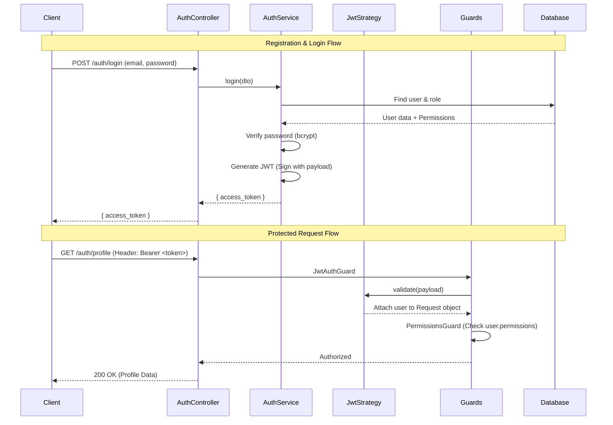

# Authentication & Authorization Flow

This document explains how the authentication and authorization system is structured in the project.

## Overview

The system uses **JWT (JSON Web Tokens)** for stateless authentication and a custom **Role-Based Access Control (RBAC)** system for authorization.

## Key Components

### 1. Authentication (`AuthService`)
The [auth.service.ts](file:///l:/Testing/backend/src/auth/auth.service.ts) handles:
- **Registration**: Hashes passwords using `bcrypt` and assigns a default role.
- **Login**: Validates credentials and issues a JWT.
- **Token Generation**: Packages the `userId`, `email`, `role`, and `permissions` into a signed JWT.

### 2. JWT Strategy (`JwtStrategy`)
The [jwt.strategy.ts](file:///l:/Testing/backend/src/auth/strategies/jwt.strategy.ts) defines how the application validates the incoming token:
- It extracts the token from the `Authorization: Bearer` header.
- It verifies the signature using the `JWT_SECRET`.
- It transforms the decoded payload into a `user` object that is attached to the request.

### 3. Guards (Authorization)
Guards act as filters for incoming requests:
- **[JwtAuthGuard](file:///l:/Testing/backend/src/auth/guards/jwt-auth.guard.ts)**: Ensures the user is logged in (has a valid token).
- **[PermissionsGuard](file:///l:/Testing/backend/src/auth/guards/permissions.guard.ts)**: Used in conjunction with `@RequirePermissions()`. It checks if the user's token contains the specific permission slugs required for the endpoint.

### 4. Decorators
- **`@CurrentUser()`**: A utility to easily access the authenticated user object in controller methods.
- **`@RequirePermissions('PERMISSION_NAME')`**: Used on controller methods to tell the `PermissionsGuard` what permission is needed.

## Security Features
- **Stateless**: The server doesn't store sessions; all info is in the JWT.
- **Password Hashing**: Passwords stored in the [Database](file:///l:/Testing/prisma/schema.prisma) are always hashed with `bcrypt`.
- **Granular Permissions**: Permissions are attached to roles, allowing for fine-grained control over API access.
